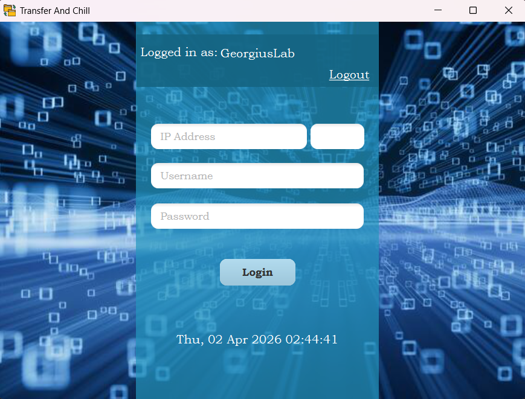
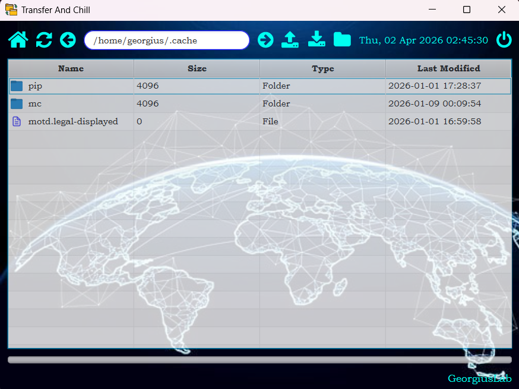

# Transfer And Chill App

## Overview
This project was developed as part of a university course and represents my first JavaFX application.  
The goal of the application is to simplify working with SSH connections by providing a user-friendly interface for connecting to remote servers and transferring files.  

Instead of relying solely on command-line operations, the app visualizes the process and even supports **drag-and-drop file transfers**, making remote file management more intuitive.

## Features
- **User Registration & Authentication**  
  Simple sign-up and login functionality to access the application.

- **SSH Connection Management**  
  Connect to any computer running an SSH server by specifying:
  - IP address  
  - Port  
  - Username  
  - Password  

- **File Transfer Visualization**  
  - Drag-and-drop support for copying files between local and remote systems.  
  - Clear interface for managing transfers.  

- **Learning-Oriented Implementation**  
  As this is my first JavaFX project, the code may contain mistakes or areas for improvement.  
  The project is part of my learning journey in Java development, combining backend logic with a practical UI.

## Technologies Used
- **Java**  
- **JavaFX** for the graphical user interface

## Technical Details
The application uses **JSch** library to establish SSH connections and manage file transfers.  
For secure file transfer operations, it leverages the **ChannelSftp** class, which provides:
- Upload and download functionality

## Future Improvements
- Enhanced error handling and stability 
- Improved UI/UX design for smoother interaction  
- Logging and monitoring of transfer activities  

## Disclaimer
This project is intended for educational purposes.  
It may not yet be production-ready, but it demonstrates the core idea of simplifying SSH-based file transfers through a visual interface.

---

### Author
Developed by **georgiuslab**
